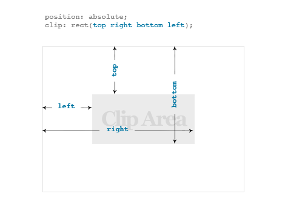

# **IR(Image Replacement) 기법**
이미지를 볼 수 없는 사용자에게 대체된 텍스트를 제공하는 것 (스크린리더 사용자를 위한 기법)

---

## **올바른 IR기법**

---

### **1. Text-indent**
	<style>
   	  .textindent_test{
        text-indent:-9999px;
      }
    </style>
	<span class="textindent_test">
      text-indent IR 기법
    </span>

> Text-indent 속성은 적용된 요소가 많을 때 컴퓨터가 웹 페이지 로드 시 위치값을 적용된 개수 만큼 계산해야 하므로 성능에 저하가 올 수 있음.
---

### **2. overflow:hidden**
	<style>
   	  .visible_test{
        position:absolute;
        left:9999px;
        width:1px;
        height:1px;
        overflow:hidden;
      }
    </style>
	<div class="overflow_test">
      overflow:hidden IR 기법
    </div>
> 원리는 text-indent랑 유사함
---

### **3. z-index를 활용한 설정**
- 이미지의 대체 텍스트에 z-index 속성 값을 음의 정수로 부여하는 방식   


	<style>
   	  .z-index_test{
      	position:relative;
        z-index:-1;
      }
    </style>
	<div class="z-index_test">
      z-index_test IR 기법
    </div>

> CSS가 정상적으로 로드되지 않을 때 숨겨진 텍스트가 화면에 출력

---
### **4. 높이와 넓이를 0으로 설정**
> 대체 텍스트 글자가 들어가는 요소의 높이와 너비를 0으로 지정하는 방법

---

## **잘못 된 IR 기법**
스크린 리더가 적용된 요소를 무시하고 모두 출력하여 사용자가 현재 화면에서 어떤 컨텐츠가 표시되는 것인지 구별 불가

---

### **1. visible:hidden**
	<style>
   	  .visible_test{
        position:absolute;
        left:9999px;
        width:1px;
        height:1px;
        visible:hidden;
      }
    </style>
	<div class="visible_test">
      visible:hidden IR 기법
    </div>
        
---

### **2. display:none**
	<style>
   	  .display_test{
        display:none;
      }
    </style>
	<div class="display_test">
      display:none IR 기법
    </div>
    
---

# **Sprite 기법**
**다량수의 이미지를 하나의 이미지로 묶고 CSS를 이용해 이미지들 마다 position 위치를 이동시켜서 특정 이미지가 보이도록 하는 기법**

---

## **장점**
- 가볍다 : 일정 간격으로 여러가지 이미지들을 하나로 만들기 때문에 이미지 파일을 여러개를 불러올 필요없이 하나의 이미지만 불러오면 됨
- 편리함 : 여러개의 이미지가 여러 곳에 분산되어 있으면 이미지를 관리하기가 불편한데 비슷한 분류의 이미지를 동일한 간격으로 배치하기 때문에 쉽게 적용 가능

---

## **단점**
- 웹페이지에 이미지를 추가/제거할때 Sprite 이미지도 같이 추가/제거를 해야함

---

**이미지를 올리면 자동으로 position 값을 보여주는 사이트** 
https://spritegen.website-performance.org/

---

# HTML strong, em과 b,i 구분

---

## strong, em과 b,i 공통점
브라우저에서 태그 사용시 굵은 글씨와 이탤릭체로 표시함

---

## strong, em과 b,i 차이점
strong, em 같은 경우에는 각각 굵은 글씨, 이텔릭체로 표시하는데 음성으로 읽을 경우 볼륨이나 톤을 변경하여 읽어주지만 b,i 같은 경우에는 웹 브라우저에서만 굵은 글씨, 이텔릭체로 표시
> 결국 b,i 태그는 강조되는 것처럼 보일 수 있지만 실제로 웹에서 음성으로 인식할때 일반 구조로 태그로 인식함

---

# CSS Box-sizing
Defalt ->  “content-box” :  width, height 속성은 오직 컨텐츠만을 포함하여 측정.  Margin-padding-border 값은 포함하지 않는다
	
---

# 선택자
``` 
.event_heading ~ div
```
 .event_heading 뒤에있는 **div형제들** 선택

```
.event_heading + div
```
-> .event_heading 바로 뒤의 **인접 div** 선택

---

# clip vs clip-path

---

## Clip 

- 해당 요소가 position값을 가져야함. 
- 오직 네모 형태로만 clip.
- 대부분의 브라우저에서 지원하지만 현재는 상용을 권하지 않음.
	
```
Clip: rect(0, 0, 0, 0);
```

좌표값은 마찬가지로 top -> right -> bottom -> left 방향.

 

---

## Clip-path
- css에서 새롭게 권장!
- 네모, 별, 세모 등 다양한 shape 가능!
- 브라우저 지원 도수가 낮음.
	 
---

## Transform
> 회전(rotation), 비틀기(skewing), 확대/축소(scaling), 평면과 3D 공간에서 이동(tranlation)  등  

```
.favorite{
    background-color: #53b5ff;
    margin-top: 20px;
    border: 10px solid #000;
    border-radius: 50%;
    width: 180px;
    height: 180px;
    text-align: center;
    line-height: 160px;
    transform: rotate(0deg) scale(1) skew(0deg);
	  /*transform: all; 위에 서술한 속성을 all로 표현가능*/	
    transition: transform .5s;
    transition-timing-function: ease-in-out;
}
.favorite:hover{
    transform: rotate(360deg) scale(.7) skew(-15deg);
}
```


