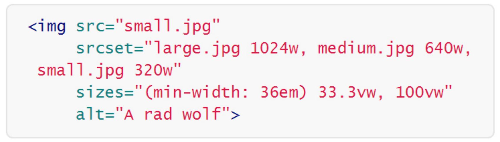

<h1>Responsive Web Design</h1>

---
<h2>웹 환경의 변화</h2>

---
<h3>모바일 디바이스가 등장하면서 반응형이 더 중요해졌다.</h3>

- 다양한 스크린 사이즈, 유연함 요구
- 모바일 초기에는 별도로 만들었다
ex. m.naver.com
- 앱을 따로 만들기도 했다
- One Source Multi-Use

---
<h3>Flexible vs Adaptive(반응형 vs 적응형)</h3>
1.  **Flexible**: 
- 모든 뷰포트에 유연하게 대응 .
- 코드도 복잡해지고 유지보수가 힘들다.
2. **Adaptive**:
- 특정 뷰포트를 설정해서, 그 사이즈 이하는 모바일, 그 이상은 데스크탑 레이아웃으로 변한다.
- 이미 존재하는 데스크탑을 응용해서 모바일 사이즈만 따로 만들면 되기때문에 유지보수가 쉬워진다.

---

<h3>Flexible Layout</h3>
- Target/Context=Result
- 계산을 돕는 generator 과 builder들이있다.
- 픽셀단위를 쓰지않음
- sass를 이용하면 보기보다 쉽게 할수있다.

---
<h3>Media Queries</h3>

---

<h3>Responsive Image</h3>

---
<h3>Responsive Image Issues</h3>

---
<h3>성능/속도 및 대역폭</h3>
- 모바일로 접근해도 원본 이미지가 렌더링 되기때문에 용량이 크다.
- ---
<h3>고해상도 디스플레이</h3>
- 고해상도 대응을 하지않으면 고해상도 디스플레이에서는 흐릿하게 보인다
---
<h3>다양한 이미지 포맷대응</h3>
- 벡터 형식의 이미지인 SVG
			- 벡터 이기때문에 어떤 환경에서도 뚜렷하게 보인다.
- 구글에서 제안한 WebP
- 마이크로소프트의 JPEG-XR
- FlashPix같은 형식
---
<h3>srcset속성</h3>
- HTML태그만을 이용하여 해상도별 이미지 분기 처리 가능

<h3>sizes속성</h3>
- 반응형 웹 화면크기에 따른 이미지 크기 변경

---
<h3>\<picture> element</h3>
- 소스가 여러개 들어갈수있다.
- 뷰포트 설정하고 해상도 대응도 해줄수 있다.
- 대응이 안되는 환경이 있을수 있기때문에 콜백을 설정해줘야한다.
---
<h3>device-pixel-ratio</h3>
- media query 사용
- 배경이미지도 늘리고 줄일수 있음
- 기본적으로 96dpi
---

	

