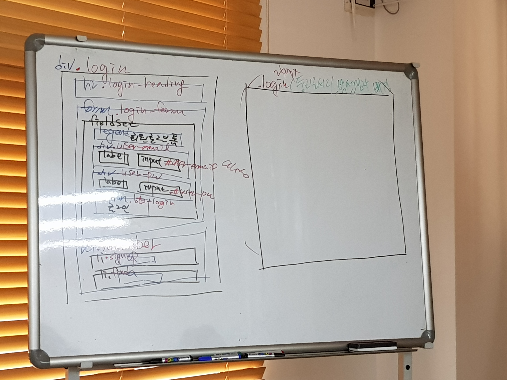
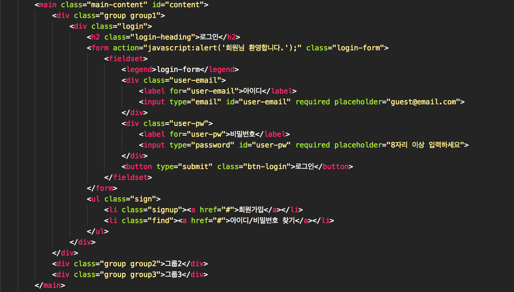
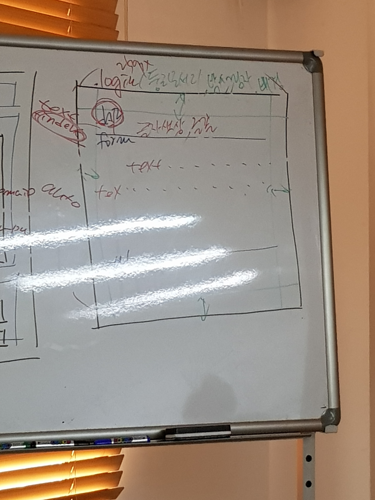
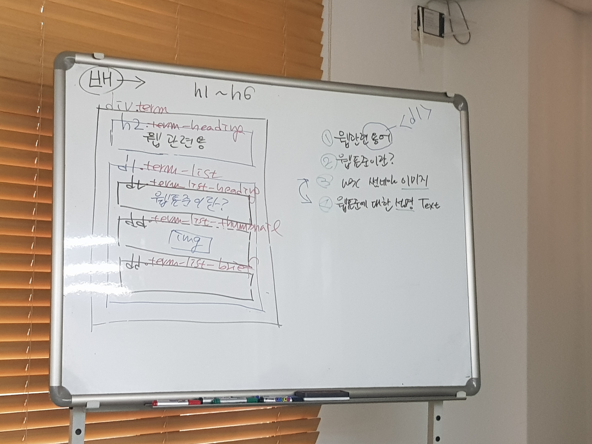
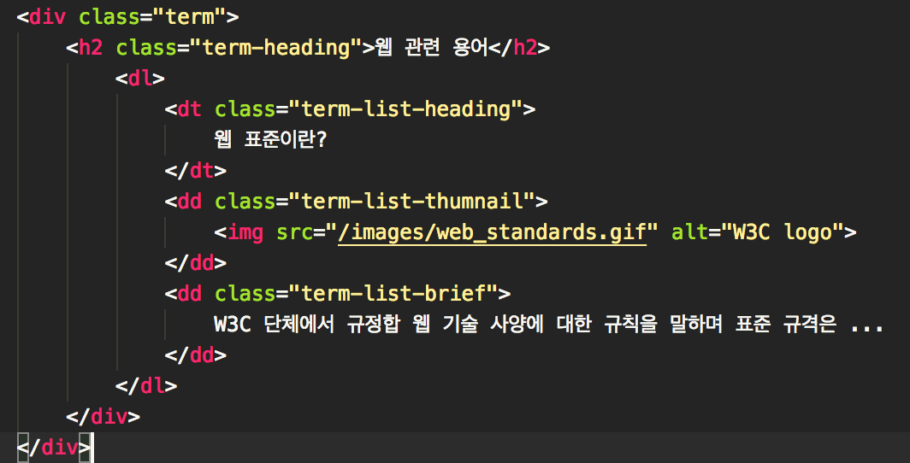

# fds0122

---
# 오전 수업 10:30 ~ 13:00 

HTML로 구조화하고 CSS로 구현 할 때
본인이 사용할 효과(태그)를 알고 있다면, 메모하고
본인이 사용할 효과(태그)에 대해서 알지 못한다면 reference를 찾아본다.

Tag
&lt; text-shadow &gt; 
&lt; text-shadow: none &gt;
&lt; text-shadow: color | offset-x | offset-y | blur-radius &gt;

## (text-shadow property) value
color : 생략 가능
offset-x, offset : text-shadow 의 좌표값(x,y) 좌표값을 음수(-)로 입력할 시 그림자가 텍스트의 좌측에 나타난다. 좌표값 (0,0)으로 입력시 텍스트 동일선상에 위치한다(.  
blur: 생략 가능, 값이 클수록
생략가능, 이 값에 비례해 블러효과가 적용된다.

---
clip-path

---

[Jsfiddle 예시](http://jsfiddle.net/davidThomas/36tg0one/)
image element의 일부만 노출 시킬 수 있는 효과이다.

---

# &lt; vertical-align &gt;

>&lt;inline&gt;, &lt;inline-block&gt; 요소에만 적용이 가능하다. 요소를 정렬하고 내용에는 영향을 끼치지 않는다. 
>-&lt;table-cell&gt; 요소와 내용에 영향을 미친다.
>-&lt;vertical-align&gt; 은 정렬하려는 요소를 다른 인라인요소에 상대적으로 정렬한다. 그래서 같은 줄에서 인라인 요소의 크기에 따라 높낮이가 달라질 수 있고 그줄에 있는 &lt;line-height&gt; 설정에 영향을 받는다.

---
## 오늘의 TIP
- <code>height</code>값은 가급적 <code>auto</code>로 두자. 콘텐츠 추가,삭제 할 때 용이하다
- <code>button</code> 태그의 스타일을 초기화해주자
    - 브라우저마다, OS마다 <code>border,padding</code>값이 제 각각이다.
    - <code>box-sizing: border-box</code>가 기본값이다.
- a태그로 새 창을 띄울때는 title속성에 새 창을 뛰운다고 미리 명시해두자
jsfiddle.net
Edit fiddle - JSFiddle
Test your JavaScript, CSS, HTML or CoffeeScript online with JSFiddle code editor.
---
## login 설계

---
## login vscode

## class login

.login 둥근모서리, 박스그림자, 배경:그라디언트

---

높이는 가급적 auto로 설정한다.
text-shadow
box-shadow
background-image: radial-gradient()
 
radial-gradient

block box 에만 사용할 수 있다 
text indent	(들여쓰기)
letter-spacing: (자간조절)

-
Web Browser 마다 form 관련 요소에서 차이가 많이 난다.

button요소에 경우 box-sizing :content-box, border-box

에이전트 스타일의 차이
버튼요소는 기본이 보더박스

button : border-box (default)

---
# Tag | List 

## <code>dl, dt, dd</code>
- &lt;dl&gt;
    - definition list, 사전처럼 용어를 설명하는 목록을 의미한다.
    - block 요소로서, dt 요소와 dd 요소 이외의 요소를 포함 할 수 없다.
- &lt;dt&gt;
    - definition term, 정의되는 용어의 제목을 의미한다.
    - Inline 요소로서, Inline 요소와 'text'를 포함 할 수 있다.
- &lt;dd&gt;
    - definition description, 정의되는 용어의 설명을 의미한다.
    - block 요소로서, Inline 요소, block 요소, 'text' 를 포함 할 수 있다.

> dt 는 div로 묶을 수 없으나, HTML 5.1 이후부터는 가능하다.

---

# 속성값

	- baseline, sub ,super, 
	- text-top, text-bottom, middle ,top , bottom, 
	- 길이값 ｜ %

>&lt; baseline &gt; : 기본값으로 부모요소의 기준선에 맞춤 
>&lt; sub &gt; : 부모의 아래첨자 기준선에 맞춤
>&lt; super &gt;: 부모의 위첨자 기준선에 맞춤
>&lt; text-top &gt; :요소를 부모의 폰트 맨위에 맞춤
>&lt; text-bottom &gt; :  요소의 맨위를 부모 폰트 맨위로 맞춤
>&lt; middle &gt; : 요소 중앙에위치
>&lt; top &gt; : 요소를 맨윗줄에서 가장 큰요소에맞춤
>&lt; botto &gt; : 요소를 맨아래줄 가장낮은 요소에 맞춤
>길이값 (px, cm등) : &lt; baseline &gt;과 같은감

---

### <code>div:nth-child(n)</code>과 <code>div:nth-of-type(n)</code> 차이점
|<code>div:nth-child(n)</code>| 앞으로부터 지정된 순서와  일치하는 요소가 div라면 선택|
|---|---|
|  <code>div:nth-of-type(n)</code> | div요소중 앞으로 순서가 일치하는 div 요소 선택  |

---

## 오늘의 TIP
- <code>height</code>값은 가급적 <code>auto</code>로 두자. 콘텐츠 추가,삭제 할 때 용이하다
- <code>button</code> 태그의 스타일을 초기화해주자
	- 브라우저마다, OS마다 <code>border,padding</code>값이 제 각각이다.
	- <code>box-sizing: border-box</code>가 기본값이다.
- <code>a</code>태그로 새 창을 띄울때는 <code>title</code>속성에 새 창을 뛰운다고 미리 명시해두자

- [clip-path MDN 자료](https://developer.mozilla.org/ko/docs/Web/CSS/clip-path)
- [vertical-align 자세히 알아보기](http://aboooks.tistory.com/171)
- 이미지의 하단에는 디센더(descender) 영역이있다. 2px정도되는 이 여백을 없에고싶으면 <code>display:block</code> 속성을 부여해주면 된다. 

# [디센더영역이 뭔가요?](http://aboooks.tistory.com/193)

---

# 오후 수업 14:00 ~ 15:00

---

## term 설계

---

## term vscode

---
# 오후 수업 15:00 ~ 16:00

## class term

---

# 오후 수업 16:00 ~ 17:00

